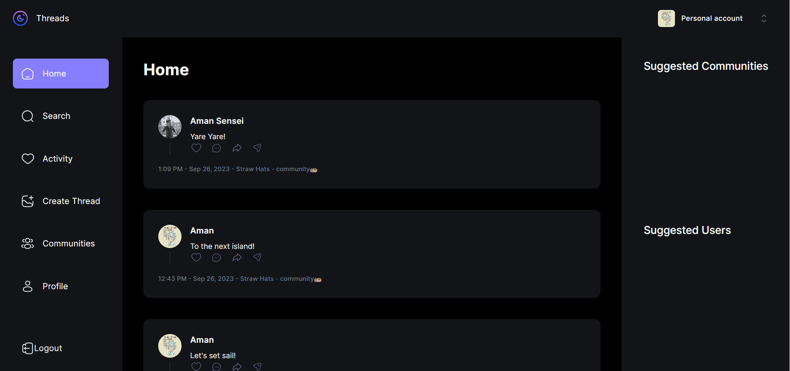
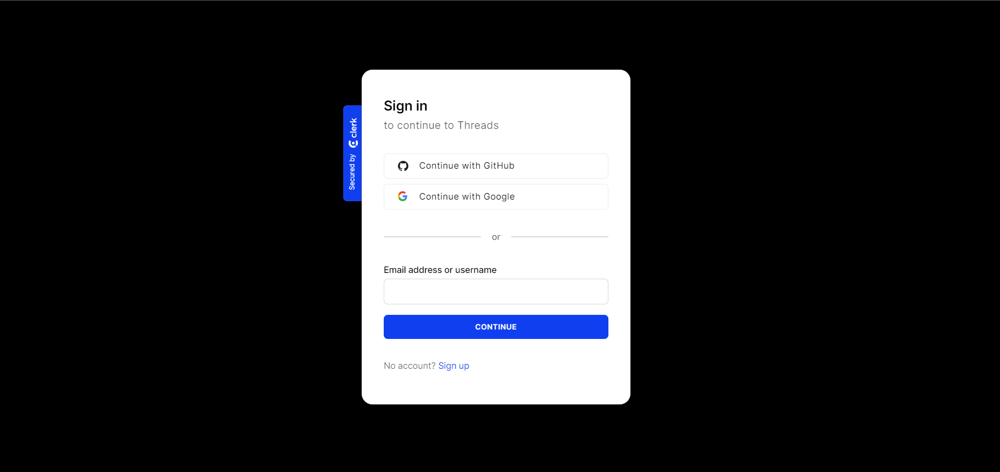
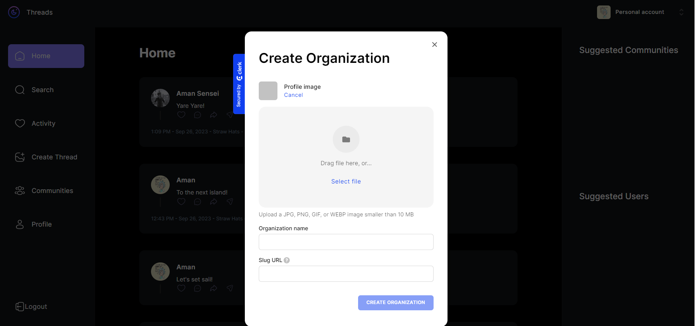
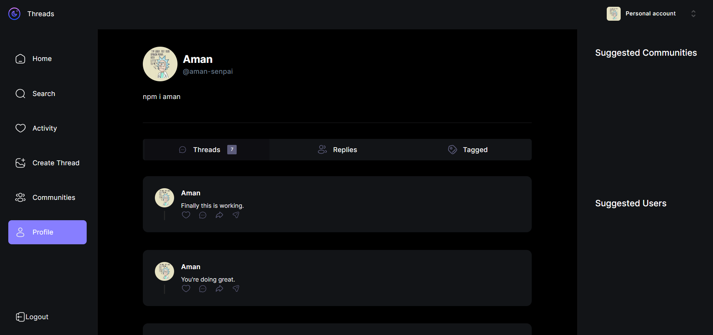
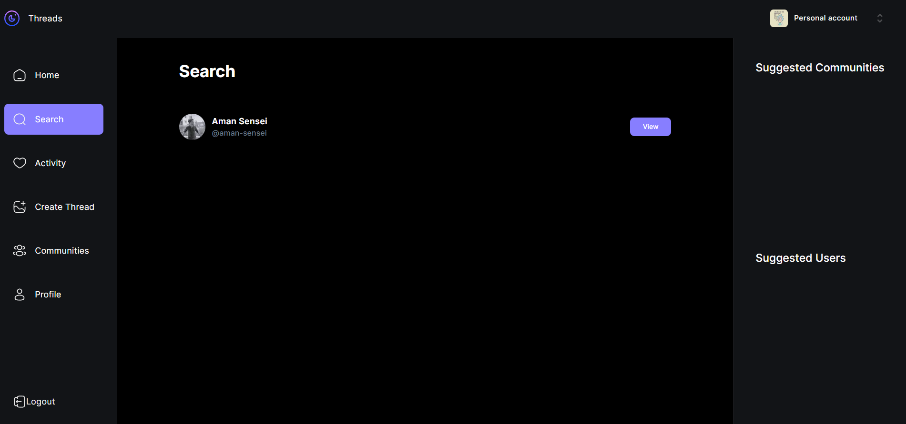

# Full Stack MERN, Next.js 13 Threads App 🚀

Welcome to our thrilling full-stack project where we embark on a journey to build and deploy a powerful application known as "Threads." 🧵 This app has achieved astounding success, with over 100 million signups in under five days, surpassing even the popularity of Chad GPT and TikTok. Get ready to clone Threads and add exciting features that outshine the original app! We'll be harnessing cutting-edge technologies including React, Next.js, TypeScript, and MongoDB.


## Table of Contents
- [Full Stack MERN, Next.js 13 Threads App 🚀](#full-stack-mern-nextjs-13-threads-app-)
  - [Table of Contents](#table-of-contents)
  - [Introduction](#introduction)
  - [Tech Stack](#tech-stack)
  - [Getting Started](#getting-started)
  - [Authentication](#authentication)
  - [Image Upload](#image-upload)
  - [Database Setup](#database-setup)
  - [User Profiles](#user-profiles)
  - [Activities](#activities)
  - [Search](#search)
  - [Thread Creation](#thread-creation)
  - [Communities](#communities)
  - [Deployment](#deployment)
  - [References](#references)

## Introduction

Threads is a phenomenon that has taken the world by storm. In this project, we'll guide you through building a clone of this app and elevating it with exciting features.

## Tech Stack

Our toolkit for this project includes:

- **Frontend:**
  - React 🌟
  - Next.js 🚀
  - TypeScript 📝
  - Clerk for Authentication 🔒
  - react-hook-form for Form Handling 📋
  - Axios for HTTP Requests 🌐

- **Backend:**
  - Node.js 🚅
  - Express.js 🌐
  - MongoDB 📊
  - Mongoose for Object Modeling 🧱
  - Axios for API Requests 🚀

- **Deployment:**
  - Vercel for Frontend Deployment 🌐

## Getting Started

Let's dive right in! Follow these steps to get started:

1. Clone the repository from [GitHub](https://github.com/yourusername/threads-clone).
2. Navigate to the project directory.
3. Install the dependencies with:

```bash
npm install
```

4. Create a `.env.local` file in the root directory and add your environment variables. Refer to the [Clerk documentation](https://docs.clerk.dev/getting-started) for setting up Clerk for authentication.

5. Start the development server:

```bash
npm run dev
```

6. Open your browser and access the application at `http://localhost:3000`. 🌐

## Authentication

We rely on [Clerk](https://clerk.dev/) for robust authentication. Clerk provides secure solutions for email and password authentication, keeping your user data safe. 🔐



## Image Upload

Users have the ability to upload profile images, powered by [Node.js](https://nodejs.org/) and the convenient [Multer](https://www.npmjs.com/package/multer) library. Images are seamlessly stored in MongoDB as part of user profiles. 📷



## Database Setup

MongoDB serves as our trusted database. To set up your database connection, simply add your MongoDB connection string to the `.env.local` file.

```env
MONGODB_URI=your_mongodb_connection_string
```

## User Profiles

User profiles are a fundamental aspect of Threads. They include user information such as username, name, bio, and profile images. This data is stored in MongoDB and fetched when users log in. 🧑📌


## Activities

Empower the users to view all the activities, likes on their thread, comment on their thread.🔔

## Search

Users can search for other profiles and even search for profiles.🔔


## Thread Creation

Empower users to create threads seamlessly. We utilize Mongoose for modeling and storing thread data in MongoDB. 🧵📝


## Communities

Communities play a vital role in the Threads app. We plan to enhance our project by adding community functionality, allowing users to create and join communities. 🏘️

## Deployment

We've got you covered when it comes to deployment! Our project is deployed using [Vercel](https://vercel.com/). This ensures your Threads clone is accessible online, enabling users to experience your app from anywhere. 🌐🚀

## References

Dig deeper with these references:

- [Clerk Documentation](https://docs.clerk.dev/)
- [Next.js Documentation](https://nextjs.org/docs)
- [MongoDB Documentation](https://docs.mongodb.com/)
- [Multer Documentation](https://www.npmjs.com/package/multer)
- [Vercel Documentation](https://vercel.com/docs)

Get ready to embark on this thrilling journey of building and deploying your very own Threads clone! If you have any questions or need assistance, don't hesitate to reach out. 🚀

**Happy Coding!** 🚀

---

*Disclaimer: This project is for educational purposes and is not affiliated with the original Threads app. All trademarks and logos mentioned belong to their respective owners.*
